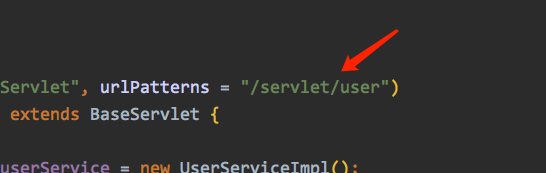
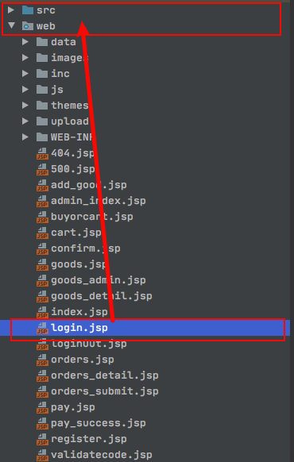
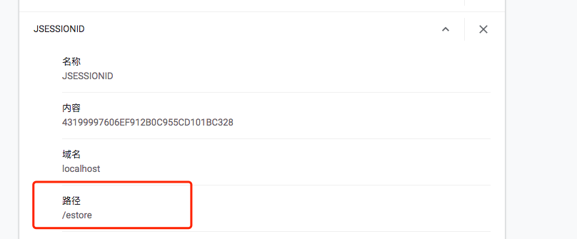
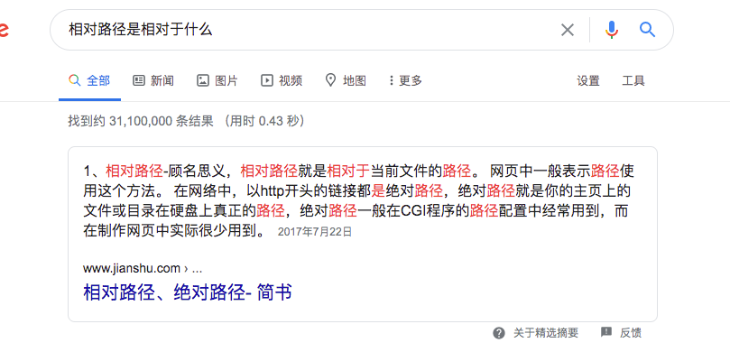

# Estore
Servlet练习项目
### 项目过程问题记录
#### 3.5登录功能
##### *1.* 请求转发问题

```java
request.setAttribute("msg", "用户名或密码错误");
request.getRequestDispatcher("/login.jsp").forward(request, response);    
```

请求转发是在项目内进行转发，这边遇到的问题是转发后的页面很多静态资源*404*



*servlet*的路径如图，发现转发后静态资源的路径变为 *xxx/estore(项目名)/servlet/xxx*，多了个*servlet*。观察*login.jsp*下面引用的静态资源发现，它们都使用的是相对路径。

以下是我的猜想：

大胆推测相对路径是相对于当前文件的位置的*（login.jsp）*，由于我们进行了转发，路径不会发生变化，所以我们现在的*login.jsp*是和*user*属于同一层次（一开始的*login*和*user*同属于项目下，现在转发同属于这个路径下）



所以导致静态路径的相对路径发生了变化，和*login.jsp*一起改变了。

将相对路径都改为绝对路径问题解决

##### *2. cookie*问题

用户登录如果勾选记住用户按钮，需要将用户名添加到*cookie*里。但是完成功能后添加和删除总是不尽人意，一会有*cookie*，一会没有。通过浏览器设置查看明明有*cookie*，但是就是不回显（排除*jsp*的错误），弄得摸不着头脑

后来通过浏览器的*cookie*发现，*cookie*有个作用路径



如图，这里生成的*JSESSIONID*就作用与*estore*项目下，也就是说整个项目可生效，对于其他项目不起作用。观察我生成的cookie后，他们的路径竟然是 */estore/servlet*

….

居然又是路径问题！

以下是我的猜测：

我猜测*cookie*生成的时候是默认作用范围是根据当前文件来的，我的*servlet*路径是 *xx/servlet/user*，就是说我的*cookie*生成在了*user*的同一层，所以导致它的作用范围在 *xx/servlet了*。那么只要设置*cookie*的作用路径就可

```java
cookie.setPath(request.getContextPath());
```

这样就作用于整个项目，而不用担心在哪生成的问题了（当然可以指定作用范围）。问题解决

##### 总结

这两个问题其实都是和路径有关的，如果我的*servlet*路径只有一层比如说是 */userServlet*，那么这两个问题都不会遇到，因为此时都是相对于项目而言的。我以前一直以为相对路径是相对于项目的，遇到这两个问题，我认识到相对路径其实是相对于本文件所在的位置的，它随时有可能改变。

我们需要顺着思路找到出现问题的原因，找到原因问题迎刃而解



如果实在项目中，绝对路径自然就是项目，***/*** **就是指的项目**

再来讲讲我对于转发、重定向这些路径写法的理解

**所有文件都要准守相对路径和绝对路径的规则**，重定向稍微特殊一点，它可以重定向到任意位置，所以直接 / 是找不到项目的，不加 / 也只是相对与当前文件而已，其他的都是一样的